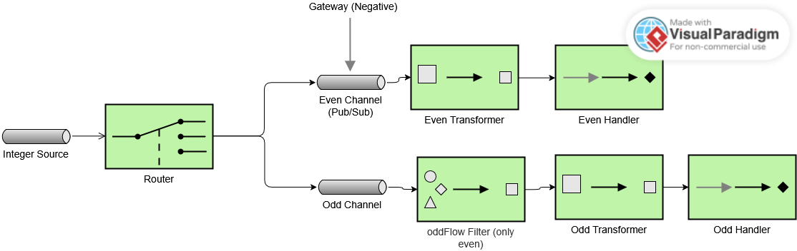

# Lab 5 Integration and SOA - Project Report

## 1. EIP Diagram (Before)

Describe what the starter code does and what problems you noticed.

The diagram BEFORE represents the real behavior of the initial starter code. It includes configuration errors that lead to incorrect system performance. These are the details of the issues observed:

- **Issue 1 - oddChannel**: The oddChannel is not declared as a publish-subscribe channel, so Spring Integration uses a default DirectChannel. This causes only one subscriber to receive messages, depending on how Spring resolves it. Using oddFlow or SomeServie.
The system is inconsistent in this regard.

- **Issue 2 - Incorrect Filter oddFlow**: The oddFlow filter uses
`filter { p % 2 == 0 }` , this means it allows even numbers to pass through the oddFlow, which is incorrect. 

- **Issue 3 - Gateway sending messages to the wrong channel**: All the negative numbers are sent to the evenChannel without going through the router. The router never sees negative numbers, so they are not processed correctly. This breaks the intended flow of the application.

- **Issue 4 - Discard channel not configured**: The discard channel is defined but not configured to handle discarded messages. It never receives any messages.

---

## 2. What Was Wrong

Explain the bugs you found in the starter code:

- **Bug 1**: oddChannel is DirectChannel instead of Publish-Subscribe Channel.
What was the problem? Why did it happen? 
In the starter code, the oddChannel there is no bean definition for oddChannel, so Spring Integration defaults to using a DirectChannel. There are 2 consumers for oddChannel (oddFlow and SomeService). 
In a DirectChannel, the message is delivered to only one subscriber, which can lead to inconsistent behavior.
How did you fix it?
Defined oddChannel as a Publish-Subscribe Channel, this delivers copies of the message to all subscribers. This follows the correct behaviour as the EIP diagram. 
What was the problem? Why did it happen? How did you fix it?
- **Bug 2**: Incorrect filter in oddFlow.
What was the second problem? Why did it happen?
Inside oddFlow, the filter condition is `filter { p % 2 == 0 }`, which allows even numbers to pass through the oddFlow. This is incorrect because oddFlow should only allow odd numbers. As consequence, some odd numbers are discarded.
How did you fix it?
Changed the filter condition to `filter { p % 2 != 0 }`, ensuring that only odd numbers pass through the oddFlow.
- **Bug 3**: Gateway sends messages to the wrong channel.
What was the third problem? Why did it happen? 
The way the gateway is configured, all negative numbers are sent directly to the evenChannel without going through the router. The problem is that it skips the logic in the router, which is supposed to determine whether a number is odd or even. This breaks the intended flow of the application.
How did you fix it?
The Gateway should send to the input channel (myFlow). To fix the problem, it is defined an explicit input channel that serves as entry point for
the poller and the gateway. The gateway was updated to send messages to this input channel. The architecture was corrected, so myFlow listens to
this input channel ensuring that every number, whether negative or positive, goes through the router for proper processing.
- **(More bugs if you found them)**

---

## 3. What You Learned

Enterprise Integration Patterns (EIP) are a useful tool for designing robust and maintainable integration solutions. Using a combination of channels, filters, routers, and services allows for a good separation of concerns and clear message flow. Spring Integration provides a complete
framework to implement these patterns effectively. It provides numerous pre-built components that can be easily configured to create complex integration scenarios. Supported by Java is a easy way to define integration flows programmatically. It´s easy to integrate these flows with other Spring projects, making it a versatile choice for building enterprise applications. It was challenging to receive all the information of the statement of work and understand the behavior of the starter code. As a solution, I decided to go step by step identifying each problem and researching the best way to fix it using EIP concepts.

---

## 4. AI Disclosure

**Did you use AI tools?** (ChatGPT, Copilot, Claude, etc.)

- If YES: Which tools? What did they help with? What did you do yourself?
I used Copilot to check for some compilation errors.
- If NO: Write "No AI tools were used."

**Important**: Explain your own understanding of the code and patterns, even if AI helped you write it.
Firslty, I identified the different elements of the EIP diagram and their purpose. Some of them easy to understand like publisher and subscriber channels or filters. The integerSource was also easy to understand as a message source that generates integers. Depending on the value of the integer, the router directs the message to either the evenChannel or oddChannel. This was easy to see on the code. The publisher/subscriber was easy to redefine, noticing how the changes affected the behavior of the application. Allowing both the oddFlow and SomeService to receive messages from oddChannel. The gateway was a bit difficult to understand at the beginning, but after reading the documentation I understood that it serves as an entry point for messages into the integration flow. I understood that the gateway should send messages to the input channel (myFlow) instead of directly to evenChannel. This ensures that all messages, negative or positive, go through the router for succesful processing.  

---

## Additional Notes

Any other comments or observations about the assignment.
